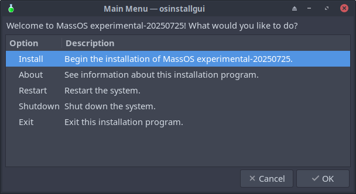

# osinstallgui
Extremely fast and minimal GUI installer for GNU/Linux operating systems.



# Information
**osinstallgui** is an extremely fast and minimal GUI installer for GNU/Linux
operating systems written entirely in Bash. It makes use of **yad** to provide
an intuitive dialog-based GTK3 graphical interface, which aims to be fast,
intuitive, and no-nonsense. **osinstallgui** has also been designed to be
easily adaptable and customisable, to allow it to be used by almost any
GNU/Linux distribution.

**osinstallgui** was originally created in December 2024, as a full rewrite of
the TUI-based installation program from MassOS, using GTK3-based **yad**
instead of ncurses-based **dialog**. However, it has also been redesigned
and reimagined from the ground-up to be more distribution-independent, through
the use of a single well-documented configuration file which can be customised
to suit the needs of other distribution maintainers. The underlying logic has
also been completely revamped, so as to make the program more reliable under
the hood, as well as easier to maintain.

**osinstallgui** is the defacto installation program used in MassOS, as of the
development of MassOS being picked up in January 2025.

# Development Status
As of **April 2025**, **osinstallgui** is still in development. Some features
are not yet present, and some functionality is in the process of being added or
improved. However, the installer itself is usable and should be mostly stable
and bug-free.

All additional functionality we want to be present in **osinstallgui**, and are
continuously working on implementing, is expected to be present when the
project gets its first **1.x.x** release. The current versions of the software
are given as **0.x.x**, to indicate that they are pre-releases and may be
subject to change at short notice. The [FAQ document](FAQ.md) has more
information about how **osinstallgui** is and will be versioned.

# Dependencies
Please note that all dependencies listed here use their upstream package names.
Many distros package libraries, services and utilities separately. Unless
otherwise stated, when a package is listed here, it is referring to the ENTIRE
package, but particularly its command-line utilities.

## Required dependencies
- **bash**, to run the program.
- **dosfstools**, to allow creation of a FAT32 EFI System Partition.
- **e2fsprogs**, to allow the user to use ext4 for the root partition (even if
  **btrfs-progs** is installed as mentioned below, this package is still
  mandatory for compatibility reasons).
- **gptfdisk**, for the erase disk functionality.
- **GRUB**, for the bootloader (installed on the target system).
- **libxkbcommon**, for finding available X11 keyboard layouts.
- **parted**, for the erase disk functionality.
- **squashfs-tools**, for extracting rootfs images. Mandatory for compatibility
  reasons, even if a tar-based rootfs is used instead.
- **yad**, for the GTK3 GUI.
- **yq**, for finding available X11 keyboard layouts.

## Recommended dependencies
- **btrfs-progs**, to allow the user to use btrfs for the root partition (if
  present, the user will be given the choice as to whether they want to use
  ext4 or btrfs, unless `OSINSTALLGUI_ALLOW_BTRFS` is set to `0` in the
  osinstallgui configuration file).
- **cryptsetup**, to allow the user to enable disk encryption using LUKS (if
  not present, the user will not be given such a choice - if it IS present,
  you can set `OSINSTALLGUI_ALLOW_LUKS` to `0` in osinstallgui's configuration
  file to forcibly disable it). Please note that the GRUB bootloader may need
  modifications to be able to properly support booting from a LUKS encrypted
  partition - see the FAQ document for detailsd.
- **dmidecode**, to allow the system model to be determined, for the default
  hostname (if not present, "PC" will be used as a fallback, but the user can,
  of course, still customise the hostname themselves and override the default).
- **gparted**, to allow the user to manually create/modify partitions using
  this external program. The manual partitioning option will be unavailable if
  this is not present.

## Optional dependencies
- **cracklib**, to enable enforcing of strong passwords for user accounts.
  Requires `OSINSTALLGUI_USER_PWSCORE` to be set to `1` in the osinstallgui
  configuration file. It only really makes sense to use if your distro's build
  of shadow was configured to use libcrack, so as to be consistent with the
  behaviour of `passwd`. Using this option may annoy "those" users who for some
  reason are completely incapable of setting and using semi-secure passwords.
- **systemd**, for finding available keymaps using `localectl`, as a faster
  alternative to manually searching through system files. If present, you can
  also set the `OSINSTALLGUI_KEYMAPS_SYSTEMD` option to decide whether you want
  `localectl` to be used or not.

# Installation
osinstallgui uses a Makefile-based approach to installation. The `make` utility
will be needed to interact with this.

First, you have to prepare the program for installation. This is because in its
default state from the source tree, it is not configured to understand where to
search for its configuration and data files. You can prepare it by running the
following command:
```
make
```
By default, this will set the directory for config and data to
`/usr/share/osinstallgui`. If this is undesired, you can customise it by
instead using the following command:
```
make DATADIR=/path/to/custom/datadir
```
After the program is prepared, it can be installed with the following command,
which may require root privileges depending on your environment:
```
make install
```
If you customised the data directory as mentioned above, then instead run the
following command to ensure the files get installed in the same place:
```
make DATADIR=/path/to/custom/datadir install
```
You may also wish to customise where the binary gets installed (the default
location is `/usr/bin`). Note that this option only needs to be passed during
installation, and doesn't need to be set during the preparation stage. It can
be set instead of or as well as the DATADIR option:
```
make BINDIR=/path/to/custom/bindir DATADIR=/path/to/custom/datadir install
```
If creating a distro package, then you can also use the `DESTDIR` option as you
should be familiar with from packaging other software. `DESTDIR` doesn't affect
the other options, which should still be relative to where the program will
be run from when the package is installed.

# Configuration
osinstallgui needs to be correctly configured to function properly (or at all)
as an installer for your distro. The sample configuration file in the source
tree, **osinstallgui.conf**, should be modified as necessary for your distro.
All possible configuration options are described in detail in this file. You
can either edit the file directly in the source tree, or edit it after it has
been installed (see the **Installation** section above). The comments in the
configuration file describe which options are **mandatory** (the program won't
run without them), and which are **optional** (the program will assume defaults
if they are unset). For robustness, we always recommend ensuring every possible
configuration option is set, however.

# Desktop Integration
An example desktop file is provided in this source tree, but it does not get
installed by default. To integrate properly into a desktop environment, you
should customise the **osinstallgui.desktop.example** file, and replace the
placeholders (i.e., the name of the distro and the distro's logo/icon) so it
represents your distro.

**NOTE:** You also need to replace the `<user>` placeholder in the `Exec=` line
in order for the program to launch properly. It should be set to the username
of the Live CD user. For example, the full line might look like this when
edited:
```
Exec=pkexec env DISPLAY=":0" XAUTHORITY="/home/massos/.Xauthority" osinstallgui
```

Once you've customised this file, it obviously needs to be renamed as
**osinstallgui.desktop** (removing the **.example** extension), and then it can
be installed in one or both of the following places:

- **/usr/share/applications** - In the system application list.
- **/home/\<name-of-live-user>/Desktop** - On the desktop of the live system.

Note that the `pkexec` command listed in the desktop entry file is written in
such a way to ensure the program runs successfully. Unlike `sudo`, which would
respect the user's environment variables, `pkexec` does not. As a result, GUI
programs will not correctly run as root unless the `DISPLAY` and `XAUTHORITY`
environment variables are manually set. This is why a modification is required
as described above.

# Troubleshooting
If something goes wrong during the installation, it's very possible that it was
caused by misconfiguration. When a problem occurs, the utility will inform you
of where the log file is saved; you can examine this file in a text document to
hopefully gauge some information as to what exactly went wrong. It may also be
beneficial to observe the command-line output if any, i.e., by running
`osinstallgui` from a terminal instead of from a desktop entry. It's also
possible that the program does not yet have a failsafe to gracefully deal with
your specific misconfiguration - if this is the case, please open an issue on
the GitHub repository and ensure you include the contents of the aforementioned
log file.

Please also see the [FAQ document](FAQ.md), which lists various known issues
that could occur, and potential solutions/workarounds for them.
